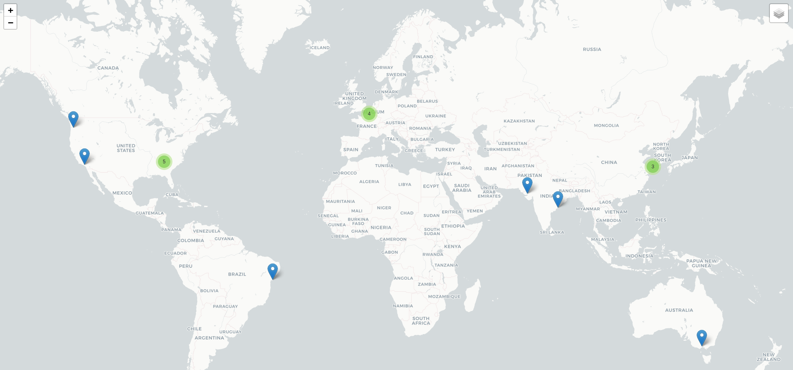
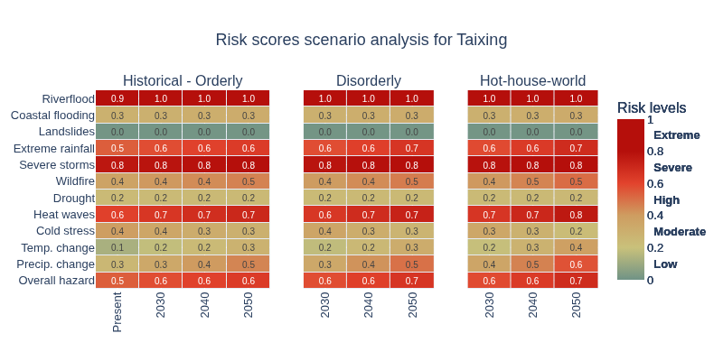
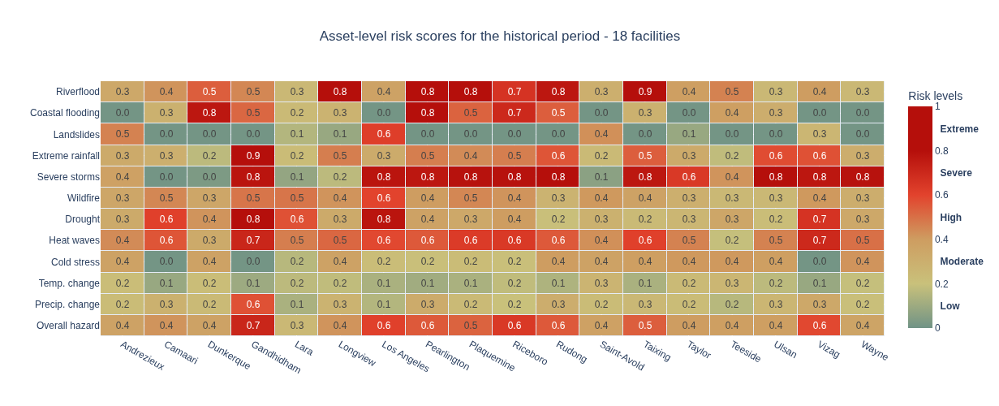

# wtn-open-source-code

Where can you source Physical Climate Risk data for any location worldwide?  
* for adaptation & resilience projects
* for IFRS- and CSRD-aligned due diligence
* for corporate sustainability reporting according to the EU Taxonomy, Appendix A
* for in-house risk management
* for insurance pricing
* for civil engineering and infrastructure projects
* for supporting your investment decisions with long positions

How long does it take? **1 second** !

Is it **global coverage**? YES!

Which types of climate hazards?  
**All hazards** in [this list](https://www.weathertrade.net/faq/hazards-indicators-and-parameters-which-ones-do-you-cover-2)

For the moment, these codes and explanations apply to one metric: [risk scores](https://www.weathertrade.net/faq/methodology-how-do-you-calculate-risk-scores-is-it-qualitative-or-quantitative-4). Codes for other types of climate risk metric will be progressively added to this project.

Risk Score metric is directly accessible via the [API](https://www.weathertrade.net/api).

This 1 minute [video tutorial](https://www.youtube.com/watch?v=BTjVBhd6PH0) explains how to use this API. 
[Technical documentation](https://www.weathertrade.net/api) explains the structure of this API.

This git project brings together a set of useful Python functions for API data collection, data transformation, analysis and visualizations.
Excel example data file is provided here as well.

If you have any questions, feel free to contact us directly at contact@weathertrade.net

Each week, we host two workshops where we explain the [methodology](https://forms.gle/gm6TbgLxcY8KszX47) and everything related to climate risk quantification, flood mapping, scenario analysis, expected loss, [value-at-risk calculations](https://forms.gle/51LmXPvroPbYEYfA7) and many other interestiong Data Science topics.

## Step 1
In your browser, [https://www.weathertrade.net/api](https://www.weathertrade.net/api)

* Type your email address
* Click EXECUTE
* Then theck your email, you will receive a temporary 4-digit code
* Go back to the [website](https://www.weathertrade.net/api) and enter this 4-digit code in the popup window
* In case you don’t see the email, please check your spam folder
* If you still haven’t received it, maybe your email address was incorrect? Try to type your email address again. 
* You see a URL like this: 

https://api.weathertrade.net/api/customer/get_data/hazards?lat=51.5098&lon=-0.1181&**key=XXX**&**email=YYY**

* Click COPY 
* Paste this URL in your browser and hit ENTER: now you can see the data for this location.

**Technical documentation** on [API here](https://www.weathertrade.net/api) explains these abbreviations.

Keep this URL locally, you need these two elements further: 

**your_api_key = XXX** (long string)   
**your_email = YYY**  

API key is your secret "password" for accessing the data.

## Step 2 : start by addining your credentials to .env

WTN_API_KEY=your_api_key  
WTN_EMAIL=your_email

## Python functions for Risk Score data processing

1. main.py regroups all functions together
<!-- 2. Call API for a specific geolocation -->
<!-- 3. Transform json for one location ⇒ create Excel file -->
<!-- 4. Transform json for multiple locations ⇒ create Excel file for a group of locations -->
2. Create dynamic HTML map
3. Scenario analysis heatmap for one location.  Compare risk scores between different periods (past vs future) and between scenarios.
4. Compare risk score values between different locations (without scenario analysis).   2D heatmap : hazards (Y-axis) x locations (X-axis)
5. Four piecharts: for two primary hazards
   * two for historical reference period, and
   * two for one forward-looking scenario, one period (default sessing rcp8.5, 2050)

## Dynamic HTML map with asset locations

Before you start analysing climate data, it is important to check visually on the map that all locations are where they are supposed to be.  
The input file for the map should include three columns: ID, Latitude, Longitude.  
See example EXCEL file with geolocations in /tmp/  
The ID is a human-readable name for each location.  
This [documentation](https://www.weathertrade.net/faq/analysis-for-multiple-locations-how-to-prepare-your-input-file-17) will help you prepare your input file with geolocations. 

## Scenario analysis heatmap for one location

This heatmap illustrates the exposure to climate-related hazards. All hazards are compared in one graph.

## Big heatmap

Compare risk score values (relative exposures) between different locations. 
(without scenario analysis) 
2D heatmap : hazards (Y-axis) x locations (X-axis)

When comparing between multiple locations, risk scores can answer these questions:
* Where is the problem? Asset A and asset B
* What kind of issue is there? Flood or Drought?
* Whch locations require attention and deep-dive analysis?

Climate risk scores answer these fondamental questions.

## Piechart

When comparing between multiple locations, risk scores can answer these questions:

* What are the two most severe hazards for this group of locations?
* How many locations are exposed to these hazards?
* Are there any locations with extreme risk? 
* Are there any locations with severe risk?
* As of today, based on all available historical data:
* What is the current risk situation?
* By 2050, according to climate model projections:
* Is there any trend within this group?
* Is the number of exposed locations expected to change over time?

