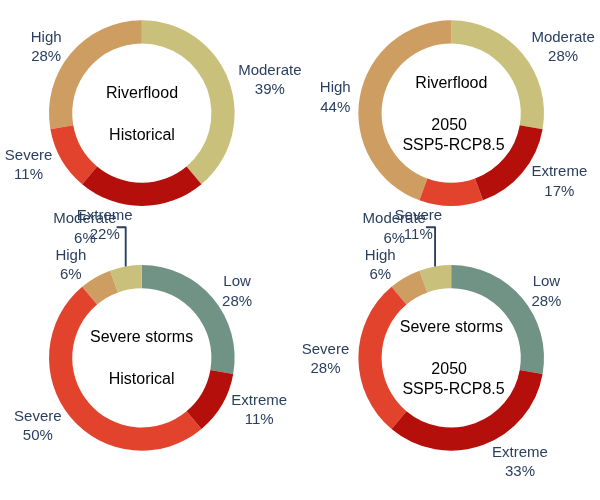

# wtn-open-source-code

Where can you source Physical Climate Risk data for any location worldwide?  
* for adaptation & resilience projects
* for IFRS- and CSRD-aligned due diligence
* for corporate sustainability reporting according to the EU Taxonomy, Appendix A
* for in-house risk management
* for civil engineering and infrastructure projects
* for supporting your investment decisions with long positions

How long does it take?
It takes 1 second!

Is it **global coverage**? YES!

Which types of climate hazards?  
All hazards in [this list](https://www.weathertrade.net/faq/hazards-indicators-and-parameters-which-ones-do-you-cover-2)

For the moment, these codes and explanations apply to one metric: risk scores. Codes for other types of metric will be progressively added to this project.

Risk Score metric is directly accessible via the [API](https://www.weathertrade.net/api).

This [video tutorial](https://www.youtube.com/watch?v=BTjVBhd6PH0) explains how to use this API. **Technical documentation** explains the structure of the data and the metric.

This git project brings together a set of useful Python functions for API data collection, data transformation, analysis and visualizations.

## Step 1
In your browser, [https://www.weathertrade.net/api](https://www.weathertrade.net/api)

* Type your email address
* Click EXECUTE
* Then theck your email, you will receive a temporary 4-digit code
* Go back to the [website](https://www.weathertrade.net/api) and enter this 4-digit code in the popup window
* In case you don’t see the email, please check your spam folder
* If you still haven’t received it, maybe your email address was incorrect? Try to type your email address again. 
* You see a URL like this: 

https://api.weathertrade.net/api/customer/get_data/hazards?lat=51.5098&lon=-0.1181&**key=XXX**&**email=YYY**

* Click COPY 
* Paste this URL in your browser and hit ENTER: now you can see the data for this location.

**Technical documentation** on [API here](https://www.weathertrade.net/api) explains these abbreviations.

Keep this URL locally, you need these two elements further: 

**your_api_key = XXX** (long string)   
**your_email = YYY**  

API key is your secret "password" for accessing the data.

## Step 2 : start by addining your credentials to .env

WTN_API_KEY=your_api_key  
WTN_EMAIL=your_email

## Python functions for Risk Score data processing

1. Call API for a specific geolocation
2. Transform json for one location ⇒ create Excel file
3. Transform json for multiple locations ⇒ create Excel file for a group of locations
4. Create dynamic HTML map
5. Compare risk scores between different periods and scenarios : scenario analysis heatmap for one location
6. Compare risk score values between different locations (without scenario analysis). 2D heatmap : hazards (Y-axis) x locations (X-axis)
7. Four piecharts: for two primary hazards
   * two for historical reference period, and
   * two for one forward-looking scenario, one period (default sessing rcp8.5, 2050)

## Dynamic HTML map with asset locations

## Scenario analysis heatmap for one location

## Big heatmap

Compare risk score values between different locations (without scenario analysis). 2D heatmap : hazards (Y-axis) x locations (X-axis)

## Piechart

